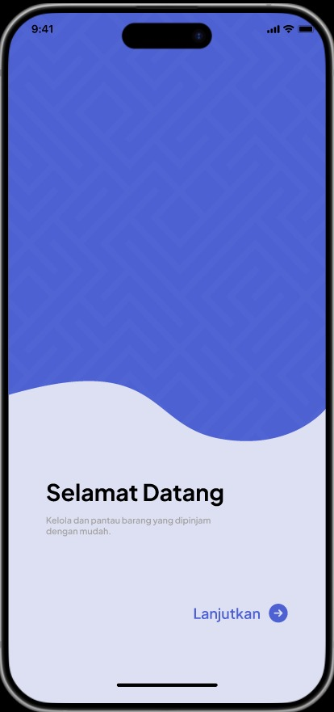
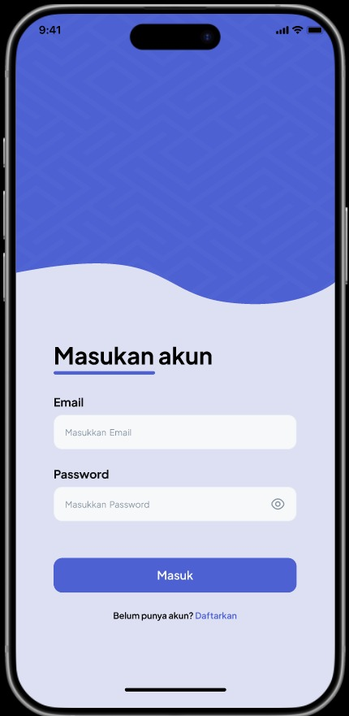
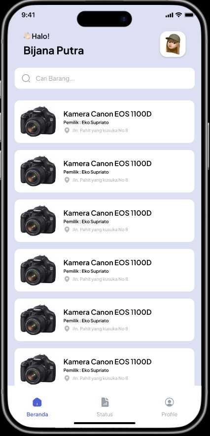
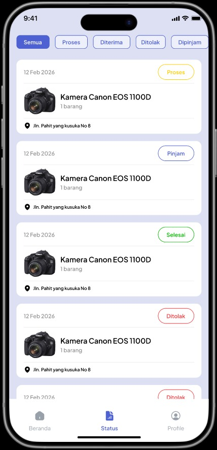
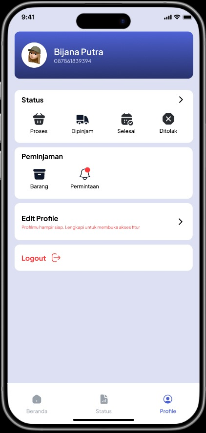
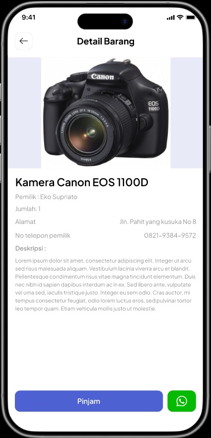
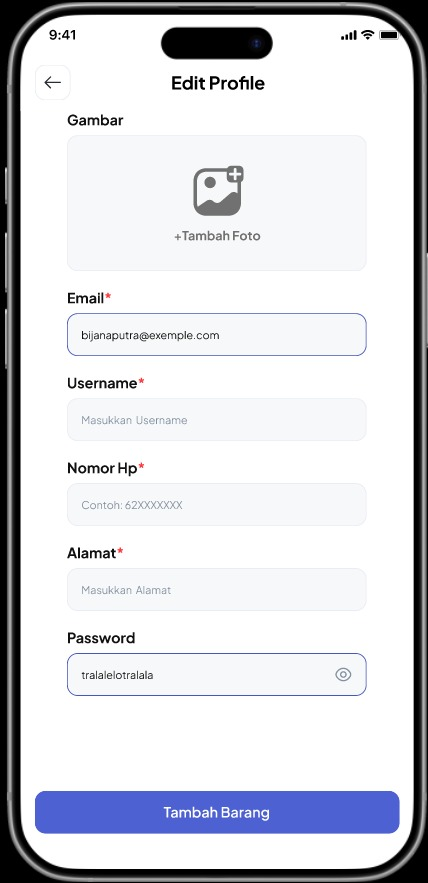
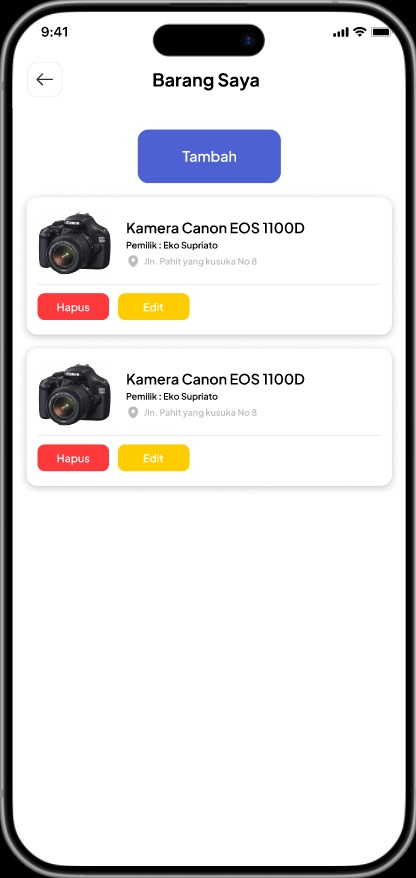

# Borrowly

Borrowly adalah aplikasi platform peminjaman barang yang memudahkan pengguna untuk meminjamkan atau meminjam barang dari orang lain dengan manajemen yang terorganisir.

## Prototype Features

* **Product Catalog:** Menampilkan berbagai barang yang tersedia untuk dipinjam oleh pengguna lain.
* **Loan Management:** Sistem untuk mengajukan, menyetujui, dan memantau status peminjaman barang secara real-time.
* **Add & Edit Product:** Pengguna dapat mendaftarkan barang miliknya sendiri untuk dipinjamkan ke komunitas.
* **User Profile:** Manajemen informasi pengguna termasuk profil pribadi dan riwayat aktivitas.
* **Onboarding System:** Alur perkenalan aplikasi untuk pengguna baru.

## Technologies Used

**Languages:**
* Kotlin

**Frameworks/Libraries:**
* Jetpack Compose (UI)
* ViewModel & StateFlow
* Coroutines
* Navigation Compose (AppNavHost)

**Dependency Injection:**
* Hilt

**Backend/Services:**
* Firebase Authentication
* Cloud Firestore

---

## Architecture & Project Structure

Aplikasi ini dibangun menggunakan arsitektur **MVVM (Model-View-ViewModel)** dengan pemisahan tanggung jawab yang jelas untuk memastikan kode mudah dipelihara dan diuji.

* **`data.repository`**: Menangani logika pengambilan data dari sumber eksternal (Firebase).
* **`ui`**: Berisi seluruh komponen UI yang dipisahkan berdasarkan fitur (Auth, Home, LoanRequest, Product, dll).
* **`di`**: Konfigurasi Dependency Injection menggunakan Hilt.
* **`theme`**: Mengatur styling global aplikasi seperti warna, tipografi, dan tema Compose.

---

## How to Run

**Prerequisites:**
* Android Studio (versi terbaru direkomendasikan)
* An Android Emulator or Physical Device

**Steps:**
   1. **Clone the repository:**
      ```bash
      git clone [https://github.com/Mizuryuuu/Borrowly.git](https://github.com/Mizuryuuu/Borrowly.git)
      ```
   2. Open in Android Studio:
      * Launch Android Studio.
      * If you see the Welcome Screen, click on `Open`.
      * If a project is already open, select `File` > `Open`....
      * Navigate to the cloned `Borrowly` folder and select it.
   3. Sync Gradle:
      * Wait for Android Studio to index files and sync the project with its Gradle files
   4. da
      * Make sure the `google-services.json` file is placed in the `app/` folder so that the Backend (Firebase) feature works properly.
   5. Run the App:
      * Select your `device/emulator` from the toolbar.
      * Click the Run button (green play icon) or press `Shift + F10`. 


   
